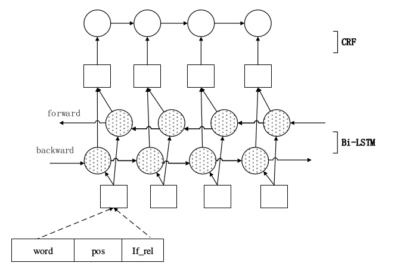
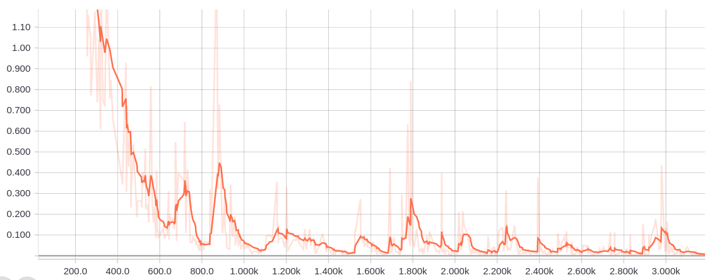

# 基于 LSTM 和 CRF 的语义标注模型

```这个repo是一个课程作业，并无论文发表，数据集是助教提供的CPB里的一部分。Free download, free use.```

## 任务描述

### 论元识别

论元识别
根据中文宾州命题库(CPB),给定某个特定的命题(/rel),识别出句子中的该命题的
论元以及其左右边界。例如在下列例句中:

> 我们/PN/O 希望/VV/O 台湾/NR/B-ARG0 当局/NN/E-ARG0 顺应/VV/O 历史/NN/O
发展/NN/O 潮流/NN/O ,/PU/O 把握/VV/rel 时机/NN/S-ARG1 ,/PU/O 就/P/O
两/CD/O 岸/NN/O 政治/NN/O 谈判/NN/O 作出/VV/O 积极/JJ/O 回应/NN/O 和/CC/O
明智/JJ/O 选择/NN/O 。/PU/O

例句已经完成分词和词性标注(part of speech, POS)。对于每一个词块
“A/B/C”,A 是词;B 是词性信息;C 是论元标记。

在上述例句中表征命题的目标动词为“把握”,该命题有两个论元“台湾当局”以
及“时机”,他们所充当的角色是 arg0 和 arg1,参评系统应能正确识别这些论元的左
右边界以及所充当的角色。如果"台湾当局"只识别出来了"台湾",是不可以算识别正确
的论元。

### 评价指标

论元识别性能采用 P/R/F 指标加以评价,具体而言:

* 命题论元识别正确率(P)=系统识别正确的命题论元数/系统识别的所有命题论元数*100%
* 命题论元识别召回率(R)=系统识别正确的命题论元数/标准答案中所有命题论元数*100%
* 命题论元识别 F 值=2*P*R/(P+R)

## 实验方法

### 模型概览

我们使用了一个双向的 LSTM 加上 CRF 实现语义角色标注。循环神经网络(Recurrent Neural Network)是一种对序列建模的重要模型,在自然语言处理任务中有着广泛地应用。不同于前馈神经网络(Feed-forward Neural Network), RNN 能够处理输入之间前后关联的问题。LSTM 是 RNN 的一种重要变种,常用来学习长序列中蕴含的长程依赖关系。另外用双向循环网络来学到历史和未来的信息。然后用前面 LSTM 网络学习输入的特征表示,在整个网络的末端用条件随机场(Conditional Random Filed)在特征的基础上完成序列标注。示意图如下:



### 实验步骤

#### a) 预处理
##### 词:
我们统计了共有 18418 个词,然后用正则表达式,将将所有的数字转换为_NUMBER、所有的人名换成_NAME、所有的年份替换成_YEAR、所有的日期替换成_DAY、所有的时间替换成_TIME。然后得到一个大小为 16314 的词典,我们选取了前 13000 个词作为词典,不在其中的词我们都替换成_UNK。

##### 词性:
我们得到大小为 32 的词性表。

##### 角色:
我们先将所有角色词前面的‘B-’、
‘S-’、
‘I-’、
‘E-’都删掉(最后我们再恢
复出这些前缀),得到一个大小为 19 的角色词表。


#### b) 构造输入
输入我们由三个部分拼接而成,分别是词、词性、是不是论元。我们把词、
词性通过词表取词向量转换为实向量表示的词向量序列,然后再拼接上论元的
one-hot 标记方式词向量。
#### c) 特征表示
将前面的词向量序列作为双向 LSTM 模型的输入;LSTM 模型学习输入序列
的特征表示,得到新的特性表示序列;

#### d) 序列标注
CRF 以上一步中 LSTM 学习到的特征为输入,以标记序列为监督信号,完成
序列标注;最后用维特比算法解码,得到最终的序列。

### 实验结果

1. 实验资源
    * Tensorflow: 1.4
    * Python: 3.6
    * 在 2 块 TITAN X 12G 显存训练

2. 模型参数
	* LSTM hidden unit: 120
	* Word embedding dim: 100
	* Pos embedding dim: 19
	* Optimizer: Adam
	* Batch_size: 128

3. 实验结果

我们在验证集上的结果见下表第一行:

(验证集文件:./data/best_eval_dev.txt)

(预测的测试文件:见根目录下 eval_test.txt)

|   | Precision | Recall | F1 |
| :----: | :----: | :----: | :----: |
| Ours | 0.727667 | 0.736989 | 0.732299 |
| w/o 替换词 | 0.702766 | 0.713769 | 0.708225 |
| w/o CRF | 0.686026 | 0.644268 | 0.664492 |

从上表中看出,第二行是我们与没有做替换词的方法的比较,可以看出替
换掉人名、数字、年份、时间等这些可以帮助提高效果。另外,我们也对比了
不用 CRF,而是直接用 LSTM 的输出结果作为标注序列的方法,可以看出,使用 CRF 来标记能很大程度提高实验结果,这说明了 CRF 作为概率化结构模型,
能更好的弥补神经网络标记偏执,不能全局归一的问题。

我们训练了大约 1.4K 个 epoch 之后稳定,时间约为 4 小时,loss 图如下:




4. 程序运行方式

> cd src
> 
> python main.py

```建议在Linux环境下打开，windows下请用除记事本外的编辑器打开```


## 参考文献
1. Sun W, Sui Z, Wang M, et al. Chinese Semantic Role Labeling with Shallow
Parsing[C]. empirical methods in natural language processing, 2009: 1475-1483.
2. Zhou J, Xu W. End-to-end learning of semantic role labeling using recurrent
neural networks[C]. meeting of the association for computational linguistics,
2015: 1127-1137.
3. Huang Z, Xu W, Yu K, et al. Bidirectional LSTM-CRF Models for Sequence
Tagging[J]. arXiv: Computation and Language, 2015.


